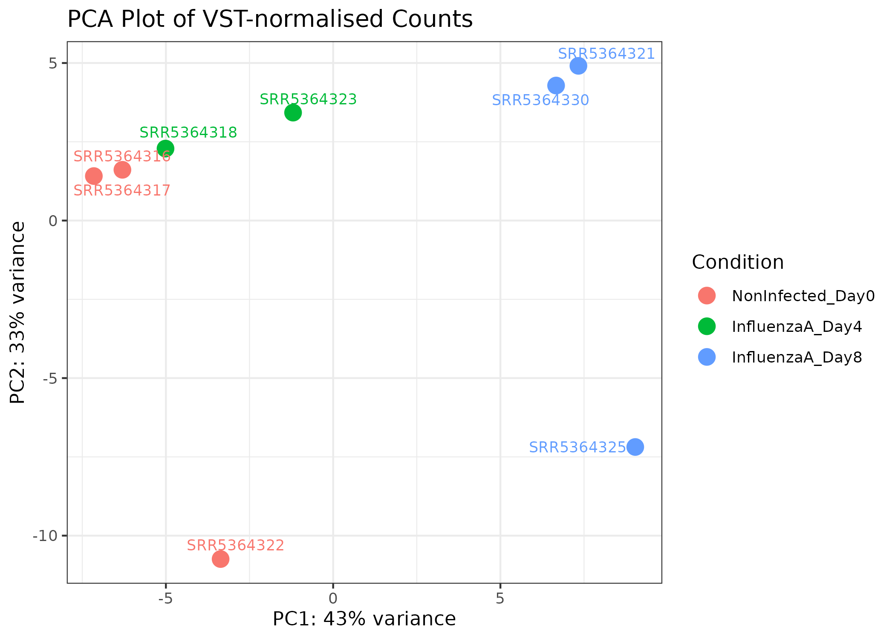
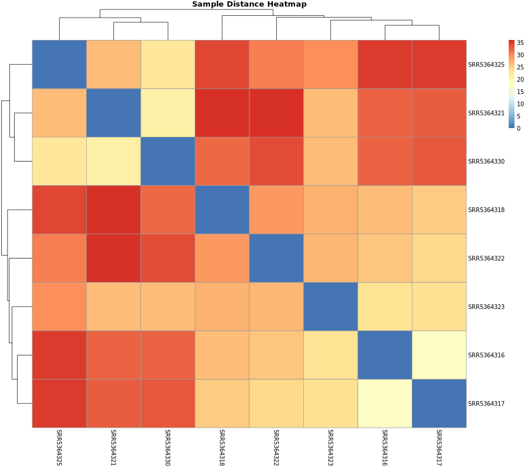
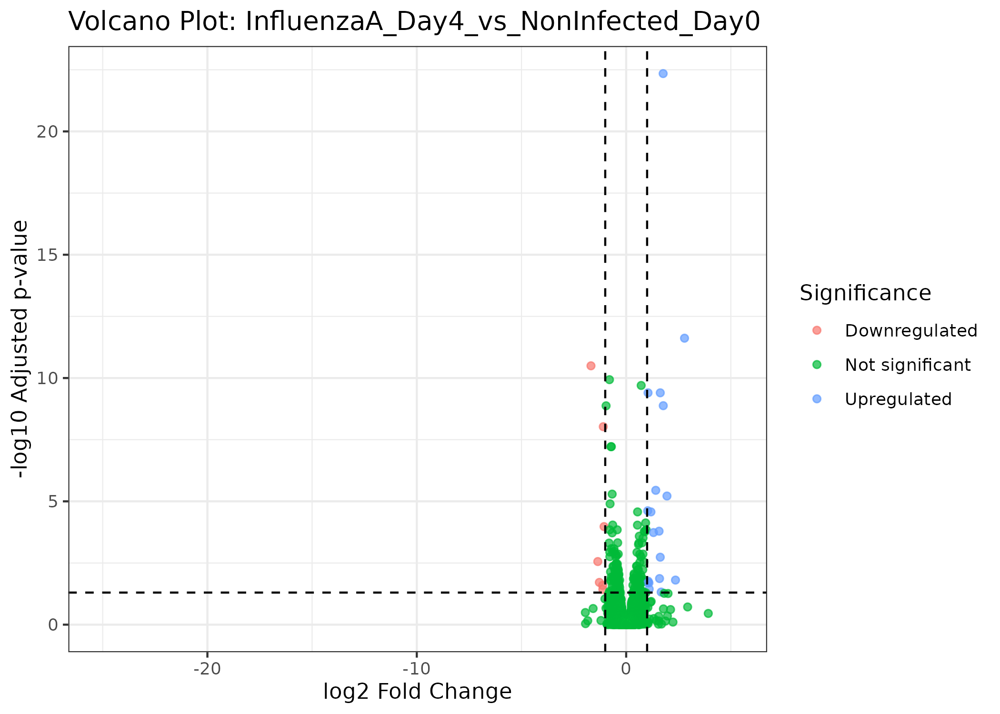
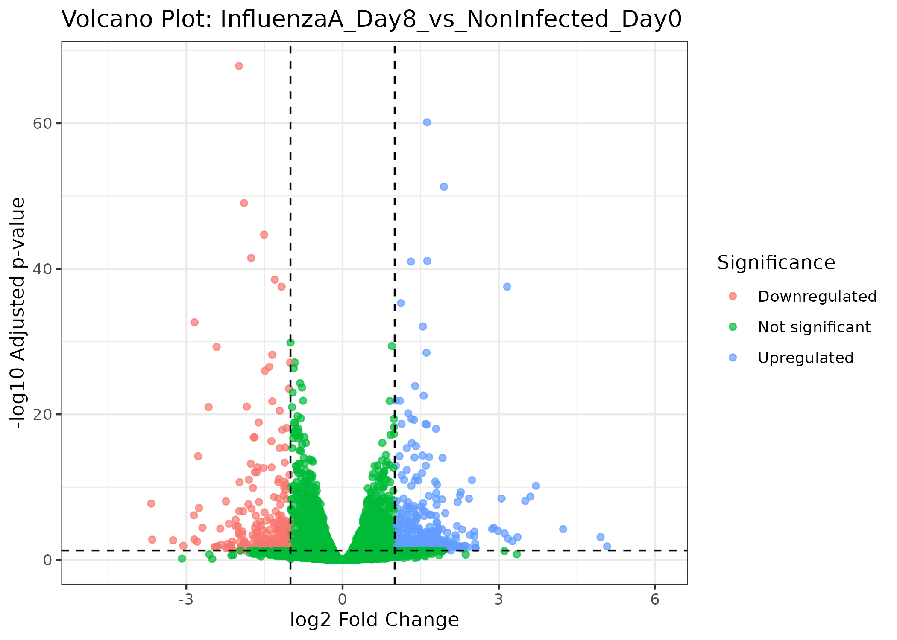

```{r setup, include=FALSE}
knitr::opts_chunk$set(echo = TRUE, warning = FALSE, message = FALSE)
library(readr)
library(knitr)
```

# Topic

Differential gene expression analysis of mouse cerebellum during influenza A infection.

# Introduction

RNA sequencing provides a genome-wide approach for measuring gene expression under different biological conditions. In this project, RNA-seq count data from mouse samples were analysed to identify genes whose expression changed following influenza A infection. The analysis compared infected samples at Day 4 and Day 8 against the non-infected Day 0 control group.

The aim of the analysis was to identify differentially expressed genes, visualize sample-level expression patterns, and interpret the biological relevance of significant genes using Gene Ontology Biological Process and KEGG pathway enrichment analysis.

# Methods

## Data Processing Summary

Raw sequencing reads were obtained from SRA accessions and processed through a standard RNA-seq workflow. Quality assessment was performed using FastQC and MultiQC. Reads were trimmed where necessary and aligned to the *Mus musculus* GRCm39 reference genome using HISAT2. Gene-level read counts were generated using featureCounts and combined into a count matrix.

## Differential Expression Analysis

The combined count matrix was imported into R and analysed using DESeq2. Sample metadata were used to define experimental conditions. Genes with very low counts were removed using a row-sum filter. Differential expression analysis was performed using the design formula `~ Condition`.

The following contrasts were evaluated:

- InfluenzaA_Day4 versus NonInfected_Day0
- InfluenzaA_Day8 versus NonInfected_Day0

Significant differentially expressed genes were defined as genes with adjusted p-value < 0.05 and absolute log2 fold change ≥ 1.

## Visualization

The following plots were generated:

- Principal component analysis plot
- Sample distance heatmap
- Volcano plots
- Heatmaps of the top differentially expressed genes
- GO Biological Process dotplots
- KEGG pathway dotplots

## Functional Enrichment Analysis

Significant genes were converted from Ensembl gene identifiers to Entrez identifiers using the mouse annotation package `org.Mm.eg.db`. GO Biological Process enrichment and KEGG pathway enrichment were performed using `clusterProfiler`.

# Results

## DEG, GO and KEGG Summary

```{r deg-summary}
summary_file <- "../results/visualization_pathway/visualization_DEG_GO_KEGG_summary.csv"
deg_summary <- read.csv(summary_file)
kable(deg_summary)
```

## PCA Plot

```{r pca-plot, echo=FALSE, out.width="80%"}

```

## Sample Distance Heatmap

```{r sample-distance-heatmap, echo=FALSE, out.width="80%"}

```

## Volcano Plots

### InfluenzaA Day 4 versus Non-infected Day 0

```{r volcano-day4, echo=FALSE, out.width="80%"}

```

### InfluenzaA Day 8 versus Non-infected Day 0

```{r volcano-day8, echo=FALSE, out.width="80%"}

```

## Top DEG Heatmaps

### InfluenzaA Day 4 versus Non-infected Day 0

```{r heatmap-day4, echo=FALSE, out.width="80%"}
heatmap_day4 <- "../results/visualization_pathway/figures/top_DEG_heatmap_InfluenzaA_Day4_vs_NonInfected_Day0.png"

if (file.exists(heatmap_day4)) {
  knitr::include_graphics(heatmap_day4)
} else {
  cat("No top DEG heatmap was generated for this contrast because too few significant DEGs were detected.")
}
```

### InfluenzaA Day 8 versus Non-infected Day 0

```{r heatmap-day8, echo=FALSE, out.width="80%"}
heatmap_day8 <- "../results/visualization_pathway/figures/top_DEG_heatmap_InfluenzaA_Day8_vs_NonInfected_Day0.png"

if (file.exists(heatmap_day8)) {
  knitr::include_graphics(heatmap_day8)
} else {
  cat("No top DEG heatmap was generated for this contrast because too few significant DEGs were detected.")
}
```

# GO Biological Process Enrichment

The top GO Biological Process terms are reported in the summary table above. Full GO enrichment tables are available in:

- `results/visualization_pathway/enrichment/GO_BP_enrichment_InfluenzaA_Day4_vs_NonInfected_Day0.csv`
- `results/visualization_pathway/enrichment/GO_BP_enrichment_InfluenzaA_Day8_vs_NonInfected_Day0.csv`

# KEGG Pathway Enrichment

The top KEGG pathways are reported in the summary table above. Full KEGG enrichment tables are available in:

- `results/visualization_pathway/enrichment/KEGG_enrichment_InfluenzaA_Day4_vs_NonInfected_Day0.csv`
- `results/visualization_pathway/enrichment/KEGG_enrichment_InfluenzaA_Day8_vs_NonInfected_Day0.csv`

# Brief Discussion

The analysis identified genes that were differentially expressed between influenza A-infected samples and non-infected control samples. PCA and sample distance heatmap visualizations were used to assess the overall relationship among samples. Volcano plots displayed the distribution of upregulated and downregulated genes, while heatmaps showed the expression patterns of the top significant genes.

GO Biological Process and KEGG enrichment analyses provided functional interpretation of the significant gene lists. Enriched biological processes and pathways may reflect host transcriptional responses associated with influenza A infection, including immune-related and infection-response mechanisms depending on the specific enriched terms obtained from the dataset.

# Conclusion

This project completed a reproducible RNA-seq analysis workflow from count matrix import to differential expression testing, visualization, and pathway enrichment. The generated output includes DESeq2 result tables, significant DEG tables, VST-normalised count matrix, PCA plot, volcano plots, heatmaps, GO enrichment results, KEGG enrichment results, and an HTML final report.

# References

Love, M. I., Huber, W., & Anders, S. (2014). Moderated estimation of fold change and dispersion for RNA-seq data with DESeq2. *Genome Biology, 15*, 550.

Yu, G., Wang, L.-G., Han, Y., & He, Q.-Y. (2012). clusterProfiler: An R package for comparing biological themes among gene clusters. *OMICS: A Journal of Integrative Biology, 16*(5), 284–287.

The Gene Ontology Consortium. (2023). The Gene Ontology knowledgebase in 2023. *Genetics, 224*(1), iyad031.

Kanehisa, M., Furumichi, M., Sato, Y., Kawashima, M., & Ishiguro-Watanabe, M. (2023). KEGG for taxonomy-based analysis of pathways and genomes. *Nucleic Acids Research, 51*(D1), D587–D592.
